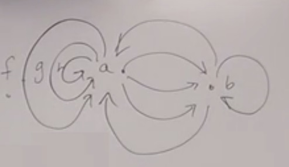
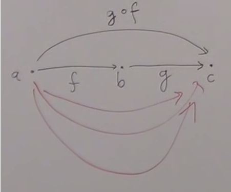
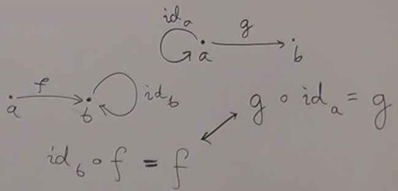
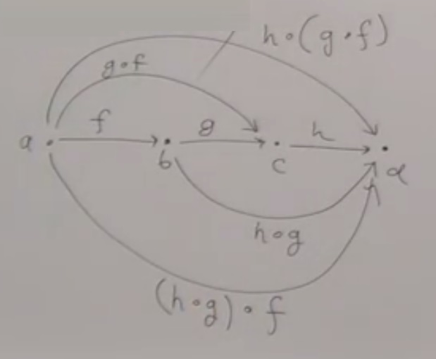

#Lecture 1.2 - What is a category?

[00:00](https://youtu.be/p54Hd7AmVFU)

The major tools in our arsenal 

* **Abstraction**  
* **Composition**  
* **Identity**

Abstraction is to get rid of unnecessary details. Things that were different because of unnecessary details are now identical.

Composition and Identity together are defined in a Category.

Categories have:

1. A 'bunch' of objects.
2. Morphisms, i.e. 'arrows' between two objects.

(Plus a composition operator, identity morphisms and associativity law, introduced later in the lecture)

The 'bunch' of objects can be a set, but it doesn't necessarily have to be. This is because there are objects that are bigger than sets1 and categories can be defined for these classes too.

From a Category Theory point of view, we cannot know what an object is. An object is no properties or internal structure. It is like a 'point'. Similarly for morphisms we cannot know it's internal structure, and the only properties we know is the beginning and end object of the arrow.

[14:00](https://youtu.be/p54Hd7AmVFU?t=820)

There are many possibilities related to how arrows can exist between objects:

* Looking at any 2 objects a, b we can see that there may be zero, 1, finite, countable or un-countably infinitely many arrows connecting them in the direction a → b.
* You can (but not necessarily) have arrows going back from b → a.
* And of course, you can have arrows from a → a.
* In this sense a category is like a graph, but it can have infinitely many objects and infinitely many arrows. Or in the other extreme, no objects at all!

# Composition

[16:20](https://youtu.be/p54Hd7AmVFU?t=980)

Given any morphisms f : a → b and g : b → c, you can compose them g ∘ f : a → c and is also a morphism in the category. 

Of course there may (or may not) be other different morphisms x, y, z : a → c, as shown by red arrows above.

You could think of composition as a multiplication table that for any two arrows, you define what is the composition.

#Identity

[20:30](https://youtu.be/p54Hd7AmVFU?t=1230)

For every object a there is an arrow id : a → a that is the identity. Denoted Ida

For all f : a → b, idb ∘ f = f (left identity)  
For all g : a → b, g ∘ ida = g (right identity)

#Associativity

[23:12](https://youtu.be/p54Hd7AmVFU?t=1392)

Given f : a → b, g: b → c, h: c → d, you can compose two ways:

* Either compose g ∘ f, then compose the result with h i.e. h ∘ (g ∘ f)
* Or compose h ∘ g, then compose f with the result i.e. (h ∘ g) ∘ f

Associativity requires that these always be equal for all morphisms f, g, and h.

I.e. For all f, g, h, h ∘ (g ∘ f) = (h ∘ g) ∘ f

What if we didn't have this law? Some mathematicians are looking into theories where the law is weakened so that is it true up to isomorpishm.

# Small Categories vs Large Categories, Groupoids

[28:27](https://youtu.be/p54Hd7AmVFU?t=1707)

In general objects don't for a set. If objects form a set we call it small, if the objects do not form a set we call it large. The morphisms between two objects do form a set in the categories we talk about. However in "higher order" categories the morpishms between two objects may not form a set. But we will not talk about such categories.

A category is not necessarily a group, but if every arrow has an inverse it is called a groupoid. It is more general than a group because a group is a category in which there is only one object, and arrows between them. However a groupoid can have multiple objects meaning that not every pair of morphisms will necessrily compose.

# Categories in Programming, Set

[31:46](https://youtu.be/p54Hd7AmVFU?t=1906)

A single argument function takes an argument of type a and returns a result of type b. So a function is an arrow between these two types. This gives a category where types are the objects and functions are morphisms. 

In Haskell it is a little bit more complicated due to lazyness. Every type has an additional value called bottom (or undefined). Therefore in Haskell, types form a category if you ignore bottom.

A model for types is they are sets of values. Therefore we can also think of the category as a category of sets, with mathematical functions between them. The category of all sets and functions between them is called Set.

When viewing Sets and functions we are aware of elements in the set, how functions map elements, etc. However when viewing Set as a category, we no longer have this information, and we just know about objects with no further structure like an atom.

Composition of functions is defined in terms of how an element is mapped through the two functions being composed. g ∘ f will take elements from the domain set of f and apply f, and then apply g giving an element in the comdomain of g. Using this definition, we create the multiplication table of how morphisms compose in Set. However we then forget these details once dealing with the category.

The usual identity function for sets becomes the category identity function.

We can identify things just looking at the morphisms, e.g. is a set empty? This can be defined purely in terms of morphisms without referencing the underlying set structure. There are lots of properties of sets that can be defined in terms of the morphisms, giving a more abstract way of looking at things.

This is the ultimate in data hiding!

[1] For example the set of all sets that are not members of itself. This can't exist. See [Russell's Paradox](https://en.wikipedia.org/wiki/Russell's_paradox) and [Barber Paradox](https://en.wikipedia.org/wiki/Barber_paradox) for more details.
